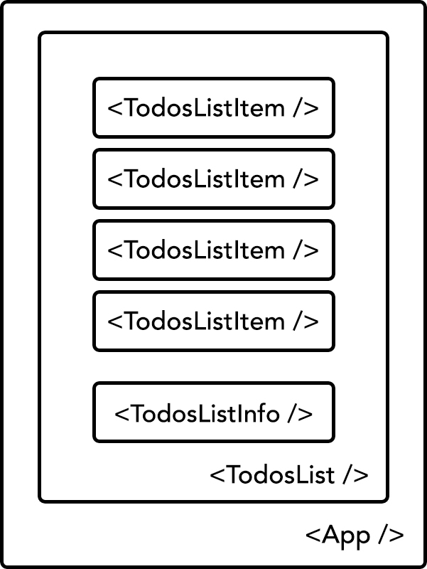
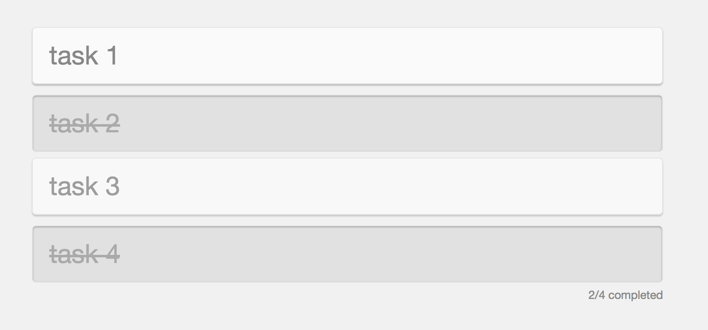

# Chapter 6: Exploring CSS Preprocessors {#Chapter-6}

In the previous chapter we covered some U&I best practices to guide us on refactoring our application. In this chapter, we'll leverage a CSS preprocessor to help us adhere to those principles.


## What is a CSS Preprocessor?

A preprocessor is a program transforms one type of data to another. In the case of CSS, we can leverage a preprocessors to extend CSS with variables, operators, interpolations, functions, mixins and many more other usable assets. 


## Why use a Preprocessor?

CSS is primitive and incomplete. CSS preprocessors offer us many useful and advanced features that help to achieve writing reusable, maintainable and extensible code in CSS. By using a preprocessor, you can easily increase your productivity and decrease the amount of code you are writing.


## Meet Sass

Although there are many powerful CSS preprocessors, such as [Stylus](http://stylus-lang.com/), [Less](http://lesscss.org/), [Myth](http://www.myth.io/), etc., we'll be using [Sass](http://sass-lang.com/). Sass has grown in popularity for a variety of reasons — most notably where Bootstrap dropped Less in favor of Sass with their Bootstrap 4 release. That said, feel free to use any CSS preprocessor you feel most comfortable with, given that they offer similar features with very little difference in syntax and style.


## Sass in Action

Since we bootstrapped our app using `create-react-app`, we'll need to modify our Webpack to be able to support  `.scss` files. This is one of the reasons we executed the `eject` script, so that we could eventually modify `create-react-app`'s config.

Install a Webpack `sass` loader:

{line-numbers=off, lang=text}
```
$ npm install sass-loader node-sass --save-dev
```

We only install these dependencies as `dev-dependencies`, since they're only needed in our build pipeline. Once installed, you can find the webpack configuration files inside `/config`. We're only concerned with `development`, but you can follow a similar set of steps for other environments as well.

{title=config/webpack.config.dev.js, line-numbers=off}
```javascript
...

      {
# leanpub-start-delete
        test: /\.css$/,
# leanpub-end-delete
# leanpub-start-insert
        test: /\.(css|scss)$/,
# leanpub-end-insert
        use: [
          require.resolve('style-loader'),
          {
            loader: require.resolve('css-loader'),
            options: {
              importLoaders: 1,
            },
          },
          {
            loader: require.resolve('postcss-loader'),
            options: {
              ident: 'postcss',
              plugins: () => [
                require('postcss-flexbugs-fixes'),
                autoprefixer({
                  browsers: [
                    '>1%',
                    'last 4 versions',
                    'Firefox ESR',
                    'not ie < 9',
                  ],
                  flexbox: 'no-2009',
                }),
              ],
            },
          },
# leanpub-start-insert
          require.resolve('sass-loader')
# leanpub-end-insert
        ],
      },

...
```

Your Webpack configuration may vary slightly, but essentially, you'll need to find and update your css loader to be able to run the appropriate loaders over both `.css` and `.scss` files.

Go ahead and restart your project by running `npm start` and everything should work just as before. Now, it's time to refactor our styles, component by component, by leveraging Sass.

If this did not work with your version of `create-react-app`, you can try the following:

{title=config/webpack.config.dev.js, line-numbers=off}
```javascript
      {
        exclude: [
          /\.html$/,
          /\.(js|jsx)(\?.*)?$/,
# leanpub-start-delete
          /\.css$/,
# leanpub-end-delete
# leanpub-start-insert
          /\.(css|scss)$/,
# leanpub-end-insert
          /\.json$/,
          /\.svg$/
        ],
        loader: 'url',
        query: {
          limit: 10000,
          name: 'static/media/[name].[hash:8].[ext]'
        }
      },
```


T> If you continue to encounter issues, please refer to the book's [source code](https://github.com/FarhadG/ui-react) to inspect the versions of the dependencies and the Webpack configuration used.

We won't be using all of the features that Sass provides, but we will cover a few fundamental features. For example, one powerful technique to increase CSS specificity is nesting. Of course, you don't necessarily need to use a preprocessor to do this as you can write out the classes with plain ol' CSS, but that's tedious and error prone.


### Configuring our Styles

Create a `styles` directory to house global files (e.g. `theme.scss`, `typography.scss`, etc.) in a production-grade application.

{title=src/styles/theme.scss, lang=text}
```
$APP: 'todos-app';

$main-background-color: #F1F1F1;
$main-font-family: "Helvetica Neue", "Arial", "sans-serif";

$light-gray: #FAFAFA;
$dark-gray: #888888;
```

We use a variable to define our app name, along with some color variables.

We move our `styles.css` file into our `styles` directory and rename it as `globals.scss`:

{title=src/styles/globals.scss, lang=text}
```
html {
  box-sizing: border-box;
}

*, *:before, *:after {
  box-sizing: inherit;
}

body {
  background: #F1F1F1;
  font-size: 10px;
  font-family: "Helvetica Neue", "Arial", "sans-serif";
  margin: 0;
  padding: 0;
}
```

Since these will be the entry styles for our entire application, we'll create a new file, `main.scss` which imports all general `.scss` files to bootstrap our application.

{title=src/styles/main.scss, lang=text}
```
@import "theme.scss";
@import "globals.scss";
```

Since we moved and renamed `styles.css`, we'll import `main.scss` to bootstrap our application:

{title=src/index.js, lang=text}
```
// dependencies
...

// local dependencies
...
# leanpub-start-delete
import './styles.css';
# leanpub-end-delete

# leanpub-start-insert
import './styles/main.scss';
# leanpub-end-insert

...
```

That said, we really haven't used our `theme.scss` files, so let's use that within `globals.scss`.

{title=src/styles/globals.scss, lang=text}
```
...

body {
  background: $main-background-color;
  font-size: 10px;
  font-family: $main-font-family;
  margin: 0;
  padding: 0;
}
```

Since we import `main.scss` file which contains `theme.scss` within its context, we can reference those variables.


### Refactoring <App />

Update `App.css` to `App.scss` and update our `import` statement:

{title=src/components/App/App.js, lang=text}
```
// dependencies
...

// local dependencies
...
# leanpub-start-delete
import './App.css';
# leanpub-end-delete

# leanpub-start-insert
import './App.scss';
# leanpub-end-insert

...
```

Then, make the following style changes:

{title=src/components/App/App.scss, lang=text}
```
@import '../../styles/theme';

##{$APP} .app {

  .todos-list {
    margin: 50px auto;
    max-width: 800px;
  }

}
```

This is where our app ID becomes useful. We import `theme.scss` and we interpolate our `$APP` variable to name space our component. The syntax may look a bit strange but all that we're doing is setting an ID (i.e. `#`) and interpolating our `$APP` variable with the `#{VARIABLE}` syntax. Now, we can easily skin our entire application in different contexts by switching themes with one variable.


### Refactoring <TodosList />

Update `TodosList.css` to `TodosList.scss` and update our import statement:

{title=src/components/TodosList/TodosList.js, lang=text}
```
// dependencies
...

// local dependencies
...
# leanpub-start-delete
import './TodosList.css';
# leanpub-end-delete

# leanpub-start-insert
import './TodosList.scss';
# leanpub-end-insert

...
```

Then, make the following style changes:

{title=src/components/TodosList/TodosList.scss, lang=text}
```
@import '../../styles/theme';

##{$APP} .todos-list {
  list-style: none;
  padding: 10px 15px;

  &-item {
    margin: 10px 0;
  }
}
```

We use the `&` operator to keep our code dry. The `&` operator inside of a selector concatenates the name of the parent in its place, so we are left with `.todos-list-item`.


### Refactoring <TodosListItem />

Update `TodosListItem.css` to `TodosListItem.scss` and update our import statement:

{title=src/components/TodosListItem/TodosListItem.js, lang=text}
```
// dependencies
...

// local dependencies
...
# leanpub-start-delete
import './TodosListItem.css';
# leanpub-end-delete

# leanpub-start-insert
import './TodosListItem.scss';
# leanpub-end-insert

...
```

Then, make the following style changes:

{title=src/components/TodosListItem/TodosListItem.scss, lang=text}
```
@import '../../styles/theme';

##{$APP} .todos-list-item {
  background: $light-gray;
  border-radius: 5px;
  border: 1px solid #E1E1E1;
  box-shadow: 0 2px 1px 0 rgba(0, 0, 0, 0.2);
  color: $dark-gray;
  cursor: pointer;
  font-size: 2rem;
  padding: 15px 20px;
  position: relative;
  transition: all 0.2s ease;

  &:hover {
    opacity: 0.8;
  }

  &.completed {
    background: darken($light-gray, 10);
    box-shadow: inset 0 1px 2px 0 rgba(0, 0, 0, 0.3);
    color: #AAAAAA;
    text-decoration: line-through;
    top: 3px;
  }
}
```

All of our `.todos-list-item` styling are nested and we've made use of the `&` operator to be able to nest additional selectors tied to `.todos-list-item`.

We also use the `darken` function. Instead of dealing with another css color, we can leverage useful Sass operations, such as `darken`, to modify existing colors.

I> CSS preprocessors, like Sass, have many useful operators that can make working with colors a breeze. Be sure to leverage them in your projects.


## Enhancements

Now that we have a good flow for creating components, we're going to introduce one additional component, as a means to show the ease of our existing architecture.


### On <TodosListInfo />

We introduce a new component that sits inside of our `TodosList`, providing some basic information about the state of our todos.


{width=60%}



### Building <TodosListInfo />

Start by creating our component directory and files:

{line-numbers=off, lang=text}
```
src/
  components/
    TodosListInfo/
      TodosListInfo.scss
      TodosListInfo.js
      TodosListInfo.spec.js
```

Next, we'll make a component rendering the number of todos remaining over the total number of todos.

{src=src/components/TodosListInfo/TodosListInfo.js, lang=text}
```
// dependencies
import _ from 'lodash';
import React, { PropTypes } from 'react';

// local dependencies
import TodosListItem from '../TodosListItem/TodosListItem';
import './TodosListInfo.scss';

const TodosListInfo = ({ todos }) => {
  const todosCount = _.size(todos);
  const completedTodosCount = _(todos).filter('completed').size();
  return (
    <li className="todos-list-info">
      {completedTodosCount}/{todosCount} completed
    </li>
  );
};

TodosListInfo.defaultProps = {
  todos: []
};

TodosListInfo.propTypes = {
  todos: PropTypes.objectOf(TodosListItem.propTypes.todo)
};

export default TodosListInfo;
```

Of course we need some styles:

{src=src/components/TodosListInfo/TodosListInfo.scss, lang=text}
```
@import '../../styles/theme';

##{$APP} .todos-list-info {
  color: $dark-gray;
  font-size: 14px;
  text-align: right;
}
```

We use a few useful Lodash functions to filter and count the number of todos. We also import `TodosListItem` to reuse the same prop types validation definitions. This may suggest a deep dependency between these two different components, but a single source of truth for these validations is good practice.

If these dependencies become unmaintainable, there are several patterns that can help decouple components from one another:

1. Create an entry file within your `components` directory that exports all components from a single source.
2. Extract all component `propTypes` into a shared resource as a single source of truth.

We'll keep things simple in our project, but it's good to be aware of your application's dependency management as the number of U&I components grow.

Let's use our new component:

{src=src/components/App/App.js, lang=text}
```
// dependencies
...

// local dependencies
...
import TodosListInfo from '../TodosListInfo/TodosListInfo';

class App extends Component {

  constructor(...args) {
    ...
  }

  componentDidMount() {
    ...
  }

  toggleTodo = (id) => (e) => {
    ...
  };

  generateTodosListItem = (todo, id) => (
    ...
  );

  render() {
    const { todos } = this.state;
    return (
      <div className="app">
        <TodosList>
          {_.map(todos, this.generateTodosListItem)}
          <TodosListInfo todos={todos} />
        </TodosList>
      </div>
    );
  }
}

export default App;
```

We import our `TodosListInfo` component and render it inside of `TodosListItem` with the appropriate props. By now, the advantages of decoupling components and ensuring a clear separation of roles should be clear.

Open your browser and you should see our new component rendering real-time todo updates.





## Summary

In this chapter, we introduced Sass, a CSS preprocessor, and leveraged some of common features to help maintain some of the practices we laid out in earlier chapters. We also added a new component as a means to test the simplicity of adding a new component to our U&I suite.

Where did we end up with our U&I checklist?


|                                 | CSS | SCSS
|---------------------------------|:---:|:----:|
| **No global namespace**         |  *  |  *   |
|---------------------------------|-----|------|
| **Unidirectional styles**       |  ✔  |  ✔  |
|---------------------------------|-----|------|
| **Dead code elimination**       |     |      |
|---------------------------------|-----|------|
| **Minification**                |     |      |
|---------------------------------|-----|------|
| **Shareable constants**         |     |      |
|---------------------------------|-----|------|
| **Deterministic resolution**    |  *  |  *   |
|---------------------------------|-----|------|
| **Isolation**                   |  *  |  *   |
|---------------------------------|-----|------|
| **Extendable**                  |  *  |  *   |
|---------------------------------|-----|------|
| **Documentable**                | NA  |  NA  |
|---------------------------------|-----|------|
| **Presentable**                 | NA  |  NA  |
|---------------------------------|-----|------|

A> [ ✔ Fulfilled ] [ * Pseudo fulfilled ]


We didn't fulfill any additional criteria, but if the previous contract state was satisfactory, adding a CSS preprocessor to your workflow is a great choice for overall quality.

Let's move onto our next chapter where we go beyond naming conventions and clever techniques to avoid styles clashing.